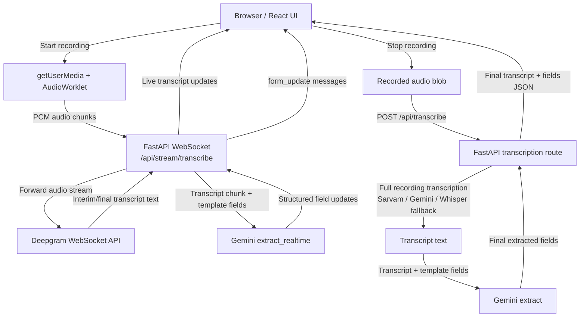

# Voice2Form

Voice2Form is a voice-driven form filling MVP with a FastAPI backend and a React frontend.

## Structure

- `backend/`: FastAPI API, template registry, audio pipeline, extraction services, Sheets sync
- `frontend/`: React + Vite client with the 4-step Voice2Form flow

## Transcription Flow



Live flow:
- Deepgram converts streaming speech to text.
- Gemini converts transcript text to structured form values.

Stop-and-extract flow:
- The full recorded file goes through the backend transcription pipeline.
- Gemini performs the final full-pass field extraction before the UI is updated.

## Backend setup

Create and activate the virtual environment:

```bash
cd backend
python3 -m venv .venv
source .venv/bin/activate
```

Install backend dependencies:

```bash
pip install -r requirements.txt
```

Set environment variables:

```bash
export SARVAM_API_KEY="your_sarvam_key"
export GEMINI_API_KEY="your_gemini_key"
export DEEPGRAM_API_KEY="your_deepgram_key"
export DATABASE_URL="your_database_url"
export GOOGLE_CREDENTIALS_JSON='{"type":"service_account"}'
export SPREADSHEET_NAME="Voice2Form Records"
export MAX_AUDIO_MB="50"
export DEFAULT_LANGUAGE="hi-IN"
export JWT_SECRET_KEY="change-this-secret"
export JWT_ALGORITHM="HS256"
export JWT_EXPIRE_MINUTES="43200"
export PASSWORD_RESET_EXPIRE_MINUTES="30"
```

Run the backend:

```bash
uvicorn main:app --reload
```

## Frontend setup

Install frontend dependencies:

```bash
cd frontend
npm install
```

Optional frontend environment values:

```bash
export VITE_API_BASE_URL="http://localhost:8000"
export VITE_SHEETS_URL="https://docs.google.com/spreadsheets/..."
```

Run the frontend:

```bash
npm run dev
```

## Authentication (new)

The app now includes a login gate before entering the Voice2Form flow.

- Google Login stores: `name`, `email`, `avatar`
- Manual Sign Up/Login stores: `name`, `email`, `password` (hashed + salted in DB)
- JWT bearer session token is returned on signup/login/google auth
- Email is globally unique and account linking is automatic:
	- Google first, then manual signup with same email links password to same user
	- Manual first, then Google login with same email links Google profile to same user

Backend auth endpoints:

```bash
GET /api/auth/me
POST /api/auth/google/login
POST /api/auth/manual/signup
POST /api/auth/manual/login
POST /api/auth/forgot-password
POST /api/auth/reset-password
```

Protected write endpoints (require Authorization: Bearer <jwt>):

```bash
POST /api/submit
POST /api/templates/custom
DELETE /api/templates/custom/{template_id}
```

Password reset notes:

- `POST /api/auth/forgot-password` generates a reset token
- Current MVP returns `reset_token` in API response (until email delivery is integrated)
- `POST /api/auth/reset-password` accepts `reset_token` + `new_password`

Build the frontend:

```bash
npm run build
```

## Verified locally

- Backend app import check passed from `backend/`
- Frontend production build passed from `frontend/`

## Notifications Architecture

Voice2Form includes a highly configurable, granular Notification Engine designed for SaaS platforms.

### Features
The notification system is deeply integrated across the platform to track events such as:
- **Billing & Subscription:** Plan upgrades/downgrades, trial expirations, failed payments, and upcoming renewals.
- **Usage Limits:** Quota alerts triggered dynamically when users hit 80%, 95%, or 100% of their form submissions or audio transcription limits.
- **Product Updates:** System-wide announcements for new feature releases (e.g., new language models).
- **Security:** Critical alerts such as new unrecognized logins or password resets (In-app security alerts cannot be disabled).

### Architecture Details
- **Channel-Specific Granularity:** Instead of global toggles, users have precise control over **In-App** and **Email** channels per category (Product, Billing, Security, Marketing).
- **In-App Bell UI:** A responsive Bell icon in the main workspace header actively polls for unread notifications, displaying a live badge and an interactive dropdown to manage alerts.
- **Backend Enforcement:** A centralized `send_notification` utility in `main.py` intercepts all system events, verifies the user's specific `DbUserNotificationPreference` opt-ins, and logs structured data (including JSON metadata and actionable URLs) into the `DbNotification` table via SQLAlchemy.

Backend notification endpoints:
```bash
GET /api/notifications/preferences
PUT /api/notifications/preferences
GET /api/notifications/unread-count
GET /api/notifications
PUT /api/notifications/{notification_id}/read
```
